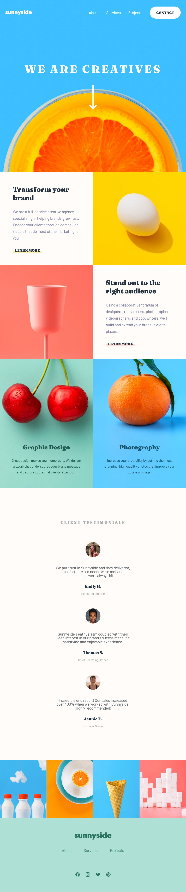
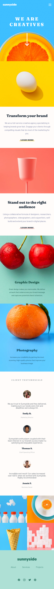
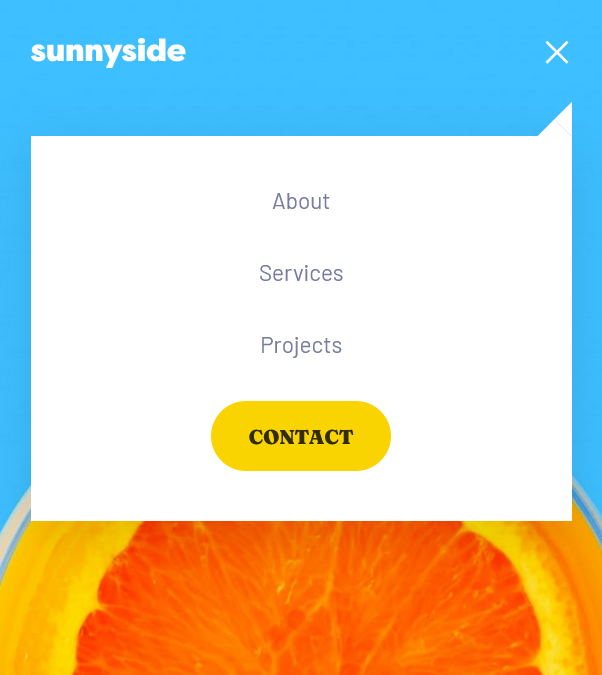

# Sunnyside

Front-end design of a website page with responsiveness for different screen formats.

 

<h3>Technologies used</h3>

 

<h3>Project Images</h3>

 

<h3>Smartphone View</h3>

 

<h3>Toggle for Small Screens</h3>

